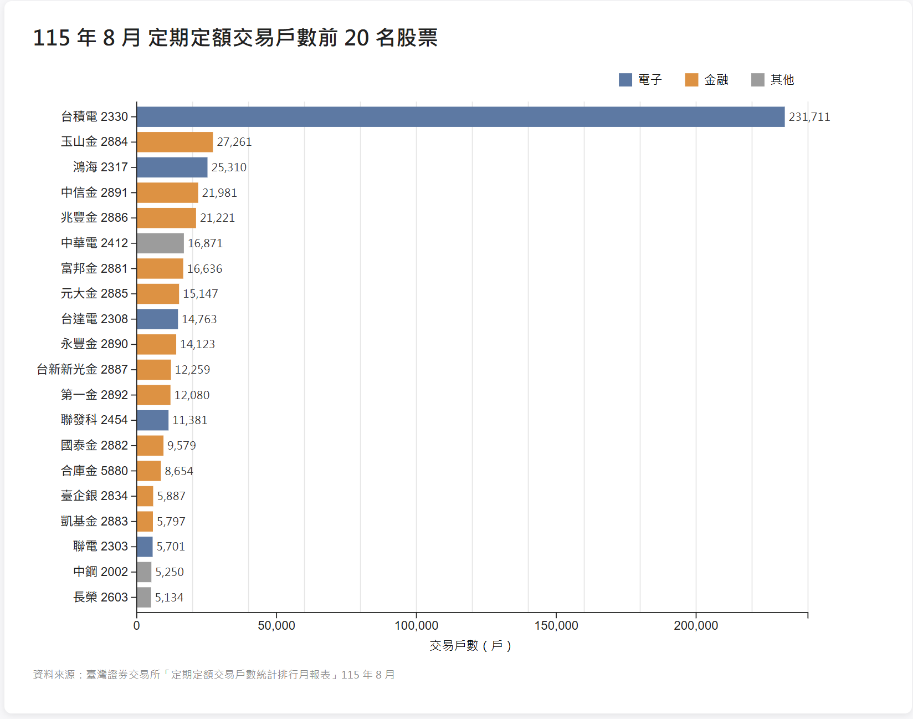

# 1151VIS-HW1-414085179-HsiehYuanChang

資料視覺化 HW1: static visualization using D3.js

- 學號：414085179
- 姓名：謝源璋
- GitHub：https://github.com/acsdqscv951478/1151VIS-HW1-414085179-HsiehYuanChang

## 專案截圖



## 資料來源

臺灣證券交易所「定期定額交易戶數統計排行月報表」115 年 8 月。原始報表包含股票與 ETF 兩組排行，本作業只取**股票前 20 名**，整理成 `public/data/stocks.csv`。

## 圖表說明

以水平長條圖呈現 20 檔股票的定期定額交易戶數，由多到少排序，並依產業分成三類上色：

- **電子**（藍）：台積電、鴻海、台達電、聯發科、聯電
- **金融**（橘）：玉山金、中信金、兆豐金等 12 檔
- **其他**（灰）：中華電、中鋼、長榮

## 執行方式

```bash
npm install
npm run dev
```
